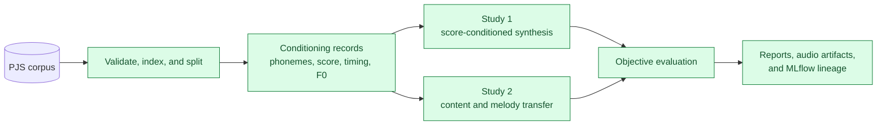
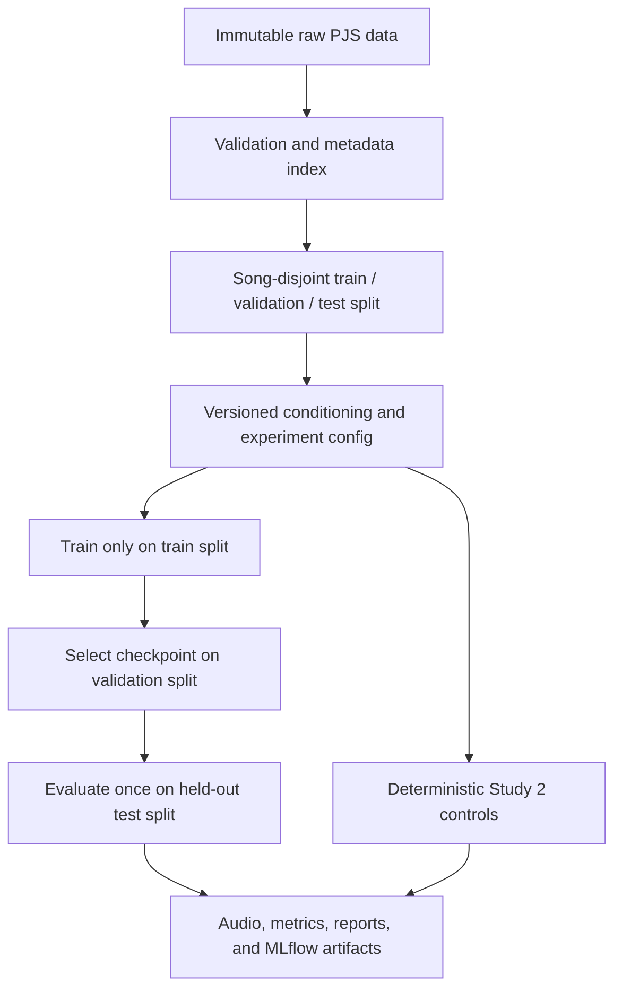
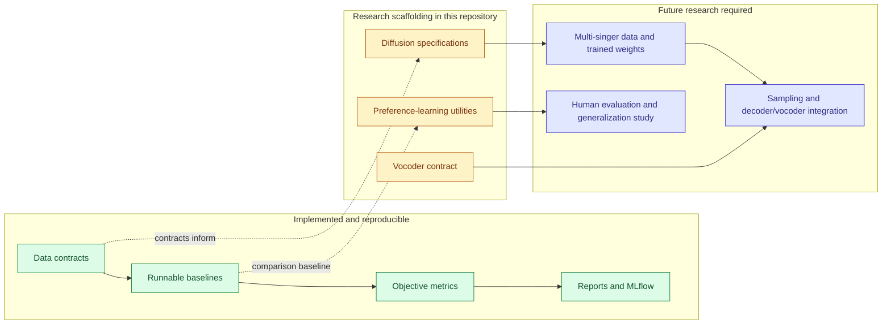

# SingAlign

SingAlign is a reproducible music-synthesis sandbox for training and evaluating
singing-voice systems. Its primary evidence is objective signal-processing
analysis: pitch and F0 accuracy, timing, spectral/mel similarity, content
preservation, clipping, and audio artifacts. Common ML metrics and optional
listening measures support that analysis; they do not replace it.

> [!IMPORTANT]
> The reproducible sandbox implementation is finalized, but its neural model
> scaffolds and research conclusions are provisional and are not production
> systems.

**Start here:** [workflow](#overview) · [study scope](#scope) ·
[run and reproduce](#reproducible-environment-and-tracking) ·
[repository map](#repository-structure) ·
[implemented vs. future work](#implementation-status-and-future-work)

## Overview

SingAlign focuses on two PJS-supported research directions: same-singer,
score-conditioned singing synthesis, and preservation of vocal content and
melody when a source vocal is placed over a different instrumental track. Each
study produces reproducible audio artifacts, MLflow lineage, and objective
signal-processing reports. It is an engineering and simulation environment
rather than a confirmatory human-subjects study.

Reward modeling, candidate reranking, supervised fine-tuning, DPO, and KTO are
retained as exploratory alignment infrastructure. They are not currently the
primary research claim because PJS is small and contains one vocalist.

This repository is structured as a reproducible research artifact: experiment
definitions, Dockerized execution, evaluation protocols, statistical analyses,
MLflow tracking, playable outputs, and research documentation live alongside
the model baselines and future-model scaffolds.



The green path is implemented as a reproducible experimental sandbox. Neural
diffusion sampling, a production vocoder, multi-singer transfer, and validated
human-preference optimization are explicitly future work.

<p align="center">
  
</p>

## Research questions

SingAlign is organized around two primary questions:

1. Can a compact model synthesize the PJS vocalist from lyrics, phonemes,
   musical score, timing, and pitch conditioning?
2. Can source vocal content, phoneme timing, and melody be preserved when the
   vocal is transferred onto a different instrumental track?

Reward-model and preference-optimization experiments remain optional
engineering diagnostics. Human-preference prediction and unseen-singer
generalization are deferred until a suitable multi-singer dataset and
evaluation design exist.

## Scope

The current research scope has two focused, reproducible studies:

| Study | Question | Implemented system | Primary outputs |
| --- | --- | --- | --- |
| **1. Score-conditioned synthesis** | Can lyrics, phonemes, score timing, and pitch reconstruct the PJS vocalist? | Conditioning parser, frame adapter, compact mel-model training, evaluation contracts | Checkpoints, mel/objective metrics, MLflow lineage |
| **2. Content-and-melody transfer** | Can a source vocal remain intelligible and melodic over a different instrumental? | Deterministic pitch/tempo alignment, fixed MIDI-rendered accompaniment, mixing, controls, evaluation | Original vocal, aligned vocal, final mix, diagnostic report |

Study 2 deliberately uses a fixed MIDI/MusicXML-rendered instrumental so vocal
alignment can be evaluated without adding accompaniment generation as a second
variable. The rendered target is an instrumental WAV, not another vocal. The
source vocal remains the content and melody reference; the target accompaniment
defines the destination musical context.

The transfer baseline changes pitch by the declared semitone interval, corrects
the resulting duration, then applies the declared tempo scale before mixing.
Automatic beat and key estimation are not implemented. The pipeline preserves
the original vocal, aligned vocal, and final mix separately and records all
control parameters and artifact lineage in MLflow. It is a transparent
signal-processing control, not a trained voice-conversion model.

The initial studies use the PJS corpus. Experiments will operate on short
mel-spectrogram segments so that data preparation, baseline development, and
pilot studies remain practical on Apple Silicon. They will address:

- vocal naturalness
- pitch and rhythm accuracy
- lyric intelligibility
- expressiveness
- audio fidelity

Singer similarity is not a generalization target because PJS contains one
vocalist; it is only a same-singer reconstruction diagnostic.

The first version will intentionally favor controlled, interpretable
experiments over model scale.

## Methodology

The shared research pipeline consists of:

1. Validate PJS phonemes, scores, lyrics, and deterministic song-disjoint
   splits.
2. Extract observed F0 and construct versioned conditioning records.
3. Train and evaluate a same-singer score-conditioned synthesis baseline.
4. Render reproducible target instrumentals from PJS MIDI/MusicXML.
5. Implement original-vocal content-and-melody remix controls, including
   tempo/key alignment and intentionally misaligned controls.
6. Compare the deterministic Study 2 control with a future synthesized-vocal
   transfer model.
7. Report lyric, pitch, timing, audio-quality, and mix diagnostics with full
   provenance.

Reward modeling, reranking, DPO, and KTO are optional exploratory extensions;
they should not be used to imply human preference alignment without suitable
data and evaluation.

The implemented controls and scaffolds are intentionally separated from the
future neural conversion stage. Any material methodological change should be
documented in the research plan and experiment logs.



### Score and lyric conditioning prototype

The repository includes a dependency-light conditioning interface in
`singalign.conditioning`. It parses PJS MusicXML into deterministic note events
and phoneme label files into timed phoneme intervals. This parser and frame
adapter are implemented and tested, but they are not themselves a trained
synthesizer or a candidate generator and do not alter the immutable corpus.

Each conditioning record contains note events as `(onset, duration, MIDI
pitch)` tuples, with `MIDI pitch = null` for rests, plus phoneme intervals as
`(start, end, symbol)` tuples in the source label timebase. This schema is
deliberately model-independent so later candidate-generation experiments can
compare conditioning encoders without changing corpus parsing.
The next alignment layer expands these events to acoustic frames using explicit
frame rate, duration, and tempo inputs; no timing is inferred implicitly.
Windowed crops pass an explicit song-time offset so score and phoneme events are
aligned to the same crop rather than implicitly restarting at time zero.
The experimental `ScoreConditionedMelModel` consumes those frame-level MIDI
pitch and phoneme IDs and predicts mel frames. It is a small runnable
architectural baseline; `ScoreConditionedMelDiffusion` defines the future
diffusion alternative using phonemes, MIDI pitch, observed F0, and frame
timing. Neither currently produces a playable synthesized vocal without a
decoder and vocoder.
Its proposed training specification is frozen in
`configs/training/conditioned.yaml`: 16 kHz audio, 80-bin log-mel targets,
100-frame-per-second conditioning, a 3-second window, and a 10-epoch
exploratory budget. The training command is implemented and tested in Docker;
held-out synthesis evaluation remains intentionally limited until a
decoder/candidate-generation protocol is specified.
The frame adapter emits integer MIDI pitch IDs with `0` for rests and integer
phoneme IDs with `0` reserved for unknown/padding symbols.
The exploratory conditioned-model trainer is available in Docker:

```bash
docker compose run --rm research \
  singalign-conditioned-train \
  --config configs/training/conditioned.yaml \
  --index data/interim/pjs/index.jsonl \
  --splits data/interim/pjs/splits.json
```

It logs training/validation loss and a checkpoint to MLflow. This is an architectural
baseline, not yet a candidate-generation or confirmatory experiment.
The run also records the immutable split fingerprint through the shared MLflow
tracking contract.
The `PJSConditionedDataset` adapter pairs these tensors with deterministic
3-second mel targets using the same crop offset, tempo, and frame-count
convention. The first Docker run completed 10 exploratory epochs and logged
MLflow run `1fd53daa1f7e494abe16ceccf7daa3c1` in experiment
`singalign-score-conditioned-baseline`; it produced a checkpoint but no
reported synthesis result.
Exported records also include deterministic pitch metadata: note/rest counts and
the minimum, maximum, and mean voiced MIDI pitch. Score pitch is an intended
conditioning signal; observed performance F0 remains a training target or
diagnostic to avoid leaking the reference performance at inference time.

Export one conditioning record for inspection inside the reproducible Docker
environment:

```bash
docker compose run --rm research \
  singalign-data conditioning \
  --musicxml /workspace/data/raw/pjs/PJS_corpus_ver1.1/pjs001/pjs001.musicxml \
  --labels /workspace/data/raw/pjs/PJS_corpus_ver1.1/pjs001/pjs001.lab \
  --output /workspace/reports/conditioning/pjs001.json
```

## Dataset plan

The initial dataset is the PJS phoneme-balanced Japanese singing voice corpus.
PJS is an approximately 0.26 GB public dataset containing 100 short singing
recordings, their spoken counterparts, MIDI and MusicXML scores, phoneme
labels, and supporting metadata. This compact, paired design supports
score-conditioned modeling and low-resource preference experiments on a local
M1 machine.

Download PJS version 1.1 from the
[official corpus page](https://sites.google.com/site/shinnosuketakamichi/research-topics/pjs_corpus).
The corpus is licensed under
[CC BY-SA 4.0](https://creativecommons.org/licenses/by-sa/4.0/), which requires
attribution and ShareAlike distribution of adapted material.

Before training begins, the project will document:

- the dataset version and retrieval procedure
- applicable access conditions and licensing terms
- allowed uses and redistribution restrictions
- singer- and song-level split construction
- known demographic, linguistic, and recording limitations

Dataset files will not be committed to this repository. The raw corpus must
remain unchanged in the ignored local data directory, and any distributed
adaptations must comply with the corpus license.

See [`data/README.md`](data/README.md) for download, installation, verification,
and provenance instructions.

### Validate and index PJS

SingAlign provides a dependency-light CLI for validating the local corpus,
building a metadata-only index, and creating deterministic song-disjoint
splits. With Python 3.11 and
[`uv`](https://docs.astral.sh/uv/) installed, run:

```bash
uv sync
uv run singalign-data validate \
  --root data/raw/pjs/PJS_corpus_ver1.1
uv run singalign-data index \
  --root data/raw/pjs/PJS_corpus_ver1.1 \
  --output data/interim/pjs/index.jsonl
uv run singalign-data split \
  --index data/interim/pjs/index.jsonl \
  --output data/interim/pjs/splits.json \
  --seed 2026
```

The generated index and split files remain local and are ignored by Git. Run
the test suite without accessing the real corpus:

```bash
uv run python -m unittest discover -v
```

## Reproducible environment and tracking

The Docker workflow provides the same Python 3.11 environment for data
validation, future training, evaluation, and MLflow experiment tracking. It
supports Apple Silicon natively.

Build the research image and start the local tracking server:

```bash
SINGALIGN_GIT_REVISION="$(git rev-parse HEAD)" \
SINGALIGN_GIT_DIRTY="$(test -n "$(git status --porcelain --untracked-files=no)" \
  && echo true || echo false)" \
docker compose build
docker compose up -d mlflow
docker compose ps
```

Passing the revision at build time lets containerized runs retain their exact
source identity without copying repository Git metadata into the image.

MLflow is available at [http://localhost:5001](http://localhost:5001). Its
SQLite database and
artifacts persist in the ignored local directory `.mlflow/`.

Validate the locally mounted PJS corpus and run all tests inside Docker:

```bash
docker compose run --rm research \
  singalign-data validate \
  --root /workspace/data/raw/pjs/PJS_corpus_ver1.1
docker compose run --rm research \
  python -m unittest discover -v
```

Verify experiment tracking end to end with a minimal run:

```bash
docker compose run --rm research \
  singalign-track smoke \
  --experiment singalign-smoke
```

### Train the reconstruction baseline

The first baseline is a compact convolutional autoencoder trained on short
log-mel segments from the PJS singing recordings. It validates the training,
checkpointing, and experiment-tracking pipeline; it is not yet a
score-conditioned singing synthesizer.

The trainer uses the training split for parameter updates and the validation
split for checkpoint selection. It deliberately cannot load the held-out test
split, which is reserved for the separate evaluation workflow.

Run locally on MPS when available, with CPU as the automatic fallback:

```bash
uv run singalign-train \
  --config configs/training/baseline.yaml \
  --index data/interim/pjs/index.jsonl \
  --splits data/interim/pjs/splits.json
```

Local MPS execution requires an ARM64 build of Python and `uv`. The Docker
workflow below is the portable fallback when host tooling runs through Rosetta
or otherwise resolves incompatible wheels.

Start MLflow and run the same experiment in Docker:

```bash
docker compose up -d mlflow
docker compose run --rm research \
  singalign-train \
  --config configs/training/baseline.yaml \
  --index data/interim/pjs/index.jsonl \
  --splits data/interim/pjs/splits.json
```

Set the training and UI listening-window duration to any positive value up to
30 seconds with `--segment-seconds N`. The resolved value is logged to MLflow and
embedded in every checkpoint. For example, an M1-friendly three-second run is:

```bash
docker compose run --rm research \
  singalign-train \
  --config configs/training/baseline.yaml \
  --index data/interim/pjs/index.jsonl \
  --splits data/interim/pjs/splits.json \
  --segment-seconds 3 \
  --epochs 1 \
  --max-validation-items 2
```

Post-training inherits the resolved duration from this baseline checkpoint.
The comparison command also defaults to the checkpoint duration, so the UI
shows matching training and listening windows. Set
`comparison.audio_segment_seconds` only when intentionally inspecting a
different inference duration.

For a short end-to-end smoke run, add `--epochs 1 --max-train-items 4
--max-validation-items 2`. Checkpoints are written beneath the ignored
`checkpoints/` directory and also attached to the MLflow run.

Build and run the test target, whose dependencies are installed by the pinned
version of `uv` from the committed lockfile:

```bash
docker compose build test
docker compose run --rm lint
docker compose run --rm test
```

The root `Dockerfile` uses shared multi-stage targets. Production dependencies,
including PyTorch and MLflow, are installed once in `runtime-dependencies`;
the `research` and `test` targets inherit that layer. The test target adds only
development tools. Source-only edits therefore reuse the large locked
dependency layer instead of reinstalling it for every service.

### Evaluate the selected baseline

Held-out evaluation is a separate command so that test examples cannot be
loaded by the trainer. Select `best.pt` using validation loss, then evaluate it
once against the immutable test partition:

```bash
uv run singalign-evaluate \
  --config configs/evaluation/baseline.yaml \
  --checkpoint checkpoints/baseline/best.pt \
  --index data/interim/pjs/index.jsonl \
  --splits data/interim/pjs/splits.json
```

Run the same evaluation through the tracked Docker environment:

```bash
docker compose up -d mlflow
docker compose run --rm research \
  singalign-evaluate \
  --config configs/evaluation/baseline.yaml \
  --checkpoint checkpoints/baseline/best.pt \
  --index data/interim/pjs/index.jsonl \
  --splits data/interim/pjs/splits.json
```

Each run writes an ignored report beneath `reports/evaluation/<run-id>/` and
attaches the report to MLflow. The report contains aggregate metrics with
bootstrap confidence intervals, per-example metrics, latency, checkpoint and
split fingerprints, and the exact evaluation configuration.

### Run proxy preference alignment

The first post-training study constructs deterministic synthetic preference
pairs from training and validation log-mel segments. A chosen candidate has a
milder controlled degradation than its rejected counterpart. The trainer uses
a DPO-style energy objective relative to a frozen baseline and a reconstruction
anchor that limits fidelity loss:

```bash
docker compose run --rm research \
  singalign-align \
  --config configs/training/alignment.yaml \
  --checkpoint checkpoints/baseline/best.pt \
  --index data/interim/pjs/index.jsonl \
  --splits data/interim/pjs/splits.json
```

For a smoke run, add `--epochs 1 --max-train-items 4
--max-validation-items 2`. The best validation checkpoint is written beneath
`checkpoints/aligned/` and attached to MLflow. The test split remains sealed
during post-training.

This is an energy-based DPO proxy for controlled experimentation, not standard
autoregressive DPO and not evidence of alignment with human preferences.

### Compare baseline and aligned checkpoints

Generate paired validation metrics and local listening artifacts without using
the held-out test split:

```bash
docker compose run --rm research \
  singalign-compare \
  --config configs/evaluation/comparison.yaml \
  --baseline-checkpoint checkpoints/baseline/best.pt \
  --aligned-checkpoint checkpoints/aligned/best.pt \
  --index data/interim/pjs/index.jsonl \
  --splits data/interim/pjs/splits.json
```

Reports are written beneath `reports/comparisons/<run-id>/`. They contain
paired deltas, bootstrap confidence intervals, win/tie/loss counts, and a
manifest referencing local reference, baseline, and aligned WAV files.
Generated model audio uses approximate mel pseudoinversion and Griffin-Lim and
must not be treated as a production-quality vocoder result.

The repository also includes `MelVocoder`, a trainable mel-to-waveform decoder
with an explicit frame hop length. It is the first differentiable vocoder
baseline for future generation experiments; it is untrained until a dedicated
vocoder dataset/training protocol is added, so Griffin-Lim remains the current
fallback for existing comparison reports.

Its reproducible exploratory trainer is available in Docker:

```bash
docker compose run --rm research \
  singalign-vocoder-train \
  --config configs/training/vocoder.yaml \
  --index data/interim/pjs/index.jsonl \
  --splits data/interim/pjs/splits.json
```

This trains only on the training split, logs validation loss and the checkpoint
to MLflow, and is an engineering baseline rather than a production vocoder.
The first 10-epoch Docker pilot is MLflow run
`421229b14e3043bfb3d89e3d6d2ca209` in `singalign-mel-vocoder`.

Evaluate that checkpoint diagnostically on the sealed test split only after
the pilot is complete:

```bash
docker compose run --rm research \
  singalign-vocoder-evaluate \
  --config configs/training/vocoder.yaml \
  --checkpoint checkpoints/vocoder/last.pt \
  --index data/interim/pjs/index.jsonl \
  --splits data/interim/pjs/splits.json
```

The report prints the split fingerprint, waveform MSE, and generated peak
level. These are engineering diagnostics, not perceptual-quality claims.

The default comparison duration is read from the checkpoints, matching the
training window. An optional positive `comparison.audio_segment_seconds` value
up to 30 seconds can override it for deliberate out-of-window inspection.
Both durations and any mismatch are recorded in the report. Longer clips
increase inversion time and memory use.

For audible inspection, each clip is selected as the highest-RMS reference
window on the configured deterministic time grid. Selection never examines
model outputs. Reports record the method, grid spacing, and selected offset for
every example.

Changing the configured split to `test` additionally requires
`--confirm-test-use`. Test evaluation should occur only after the comparison
metrics and decision rules have been preregistered.

### Inspect a comparison in the UI

Start the minimal TypeScript comparison interface after generating a report:

```bash
docker compose up --build -d ui
```

Open [http://localhost:4173](http://localhost:4173), enter the comparison run
ID printed by `singalign-compare`, and select **Load comparison**. When no run
is specified, the latest successfully completed local comparison loads by
default. The report
directory is mounted read-only. The interface displays aggregate paired
metrics and side-by-side reference, baseline, and aligned audio for each
available example.

The listening view is an inspection aid, not a blinded perceptual study. Its
generated audio is approximate Griffin-Lim reconstruction and must not be used
alone to support claims about perceptual quality. See [`ui/README.md`](ui/README.md)
for development and troubleshooting instructions.

The UI still has deferred work around richer candidate selection, conditioning
metadata, cross-condition uncertainty summaries, and a separate blinded
listening-study interface.

The UI now includes a training interface for the implemented baseline, aligned,
conditioned, vocoder, and KTO experiments with default parameters. The
Docker-backed API is started with `docker compose up --build api`; it exposes
`POST /training` for allowlisted jobs and `GET /training/<job_id>` for status.
MLflow remains available at port 5001. The browser still displays the generated
command as a reproducibility fallback.
Launch requests forward only numeric allowlisted parameters and automatically
attach the supervised checkpoint for aligned/KTO jobs.
When the API is running, submitting the form launches the Docker job and shows
its container ID; if the API is unavailable, the same command remains visible
for manual execution.

The UI workflow is organized sequentially into separate tabs: **Training** for
launching model jobs, **Evaluation** for loading and inspecting evaluation
reports, and **Comparison** for paired or multi-condition result review.
Downstream tabs remain unavailable until the relevant upstream run or report is
loaded, making the dependency order visible during reproducible experiments.

### Candidate-generation sandbox

Candidate generation is supporting infrastructure for the two primary studies.
It creates deterministic variants of a synthesis or transfer condition so we
can compare pitch, timing, lyric intelligibility, audio quality, and alignment
failures. Each candidate records its seed, method, input condition, and output
provenance.

The sandbox can also apply transparent proxy scores and stable reranking, but
these scores are engineering diagnostics—not human-preference models. DPO, KTO,
and reward-model code remains optional exploratory infrastructure and is not a
primary research direction.

Example Docker invocation:

```bash
docker compose run --rm research \
  singalign-candidates \
  --input input.pt \
  --output reports/candidates/example.json
```

Candidate reports can be logged to MLflow with their condition metadata so
results remain reproducible.

Run the exploratory KTO condition from Docker with:

```bash
docker compose run --rm research \
  singalign-kto-train \
  --config configs/training/kto.yaml \
  --checkpoint checkpoints/baseline/best.pt \
  --index data/interim/pjs/index.jsonl \
  --splits data/interim/pjs/splits.json
```

Stop the services without removing tracked runs:

```bash
docker compose down
```

Do not remove `.mlflow/` unless you intend to permanently delete the local
MLflow database and artifacts. See
[`configs/mlflow/README.md`](configs/mlflow/README.md) for storage and network
details.

## Objective evaluation plan

Evaluation is led by objective signal-processing analysis, with perceptual
evidence treated as complementary. Metrics are interpreted against the study's
reference and control conditions rather than as a single universal quality
score.

| Dimension | Candidate measurements |
| --- | --- |
| Pitch accuracy | F0 error, voiced/unvoiced error, note-level deviation |
| Rhythm accuracy | onset and duration deviation |
| Intelligibility | ASR error rate and human lyric recognition |
| Singer similarity | embedding similarity and human judgments |
| Audio quality | learned quality estimators and artifact analysis |
| Preference | blinded pairwise human comparisons |

Reported experiments will include confidence intervals, effect sizes, and
statistical tests where appropriate. Metrics will be treated as imperfect
proxies rather than interchangeable substitutes for human judgments.

The detailed protocol will live in
[`docs/evaluation-protocol.md`](docs/evaluation-protocol.md).

## Repository structure

```text
singalign/
├── configs/             Versioned training, evaluation, and MLflow settings
├── data/                Dataset provenance and local-data conventions
├── docs/                Research plans, protocols, and responsible-use analysis
├── experiments/         Registered experiment designs and manifests
├── reports/             Generated audio, metrics, figures, and reports
├── src/singalign/
│   ├── data/            PJS validation and indexing
│   ├── models/          Runnable baselines and future architecture scaffolds
│   ├── conditioning.py  Score/phoneme event parsing and frame alignment
│   ├── studies.py       Reproducible study orchestration
│   ├── transfer.py      Deterministic Study 2 transfer control
│   └── *_evaluate.py    Held-out and study-specific evaluation entry points
├── tests/               Unit and integration tests without requiring the corpus
└── ui/                  Dockerized TypeScript comparison interface
```

The separation is intentional: `configs/` and `experiments/` register what a
run means; `src/singalign/` executes it; `reports/` contains generated evidence;
and `docs/` records the interpretation and limitations. Raw data, checkpoints,
and local MLflow state are ignored rather than treated as source artifacts.

## Reproducibility principles

The project will follow these practices:

- version all reported experiment configurations
- record random seeds, software versions, and hardware assumptions
- keep evaluation splits immutable after they are registered
- identify every reported result with an experiment manifest
- distinguish exploratory results from confirmatory results
- preserve failed experiments when they inform a conclusion
- report uncertainty instead of relying only on point estimates

## Responsible research

Singing voice generation creates risks involving consent, impersonation,
copyright, and misleading synthetic media. SingAlign will therefore:

- use only datasets with documented research permissions
- avoid presenting generated voices as real performances
- disclose synthetic audio in demonstrations
- document model and dataset limitations
- avoid releasing tools intended for unauthorized voice impersonation
- preserve dataset-specific attribution and usage restrictions

See [`docs/responsible-research.md`](docs/responsible-research.md) for the
evolving risk assessment.

## Implementation status and future work

The repository is a finalized experimental engineering sandbox, not a
production singing synthesizer. The table below makes the implementation
boundary explicit.

| Area | Status | What exists | What remains |
| --- | --- | --- | --- |
| Data and conditioning | **Implemented** | PJS validation/indexing, immutable splits, score/phoneme/F0 contracts, frame alignment | Broader datasets and multi-singer conditioning |
| Study 1 baseline | **Implemented baseline** | Runnable `ScoreConditionedMelModel`, training/checkpointing, objective evaluation | A validated mel decoder and playable neural synthesis pipeline |
| Study 2 control | **Implemented baseline** | MIDI rendering, declared pitch/tempo transform, mixing, misalignment controls, evaluation | Learned content-and-melody transfer and automatic alignment |
| Reproducibility | **Implemented** | Docker, MLflow lineage, configs, manifests, tests, UI comparisons | Large-scale experiment execution |
| Diffusion models | **Scaffold only** | Forward-pass denoisers, schedules, loss and configuration contracts | Trained weights, sampling loop, vocoder connection, quality evaluation |
| Preference alignment | **Exploratory infrastructure** | Candidate, reward-model, reranking, DPO/KTO utilities | Suitable preference data and validated human evaluation |
| Generalization | **Deferred** | Same-singer diagnostics on PJS | Multi-singer, song-disjoint data and unseen-singer claims |



The diffusion code is retained to make later research interfaces concrete,
without implying results that do not exist. `ScoreConditionedMelDiffusion`
combines phonemes, MIDI pitch, observed F0, and frame timing for Study 1;
`ConditionalMelDiffusion` is the corresponding Study 2 voice-conversion
denoiser. `DiffusionSchedule` implements noisy-mel construction and the
noise-prediction loss expected by a future training loop. These components have
runnable PyTorch forward passes but no trained weights or sampler.

A complete neural system still requires song-disjoint multi-singer data,
alignment and conditioning encoders, a diffusion training and sampling loop,
and a neural vocoder. Practical training requires a CUDA-capable GPU, often
multiple GPUs. The `GET /capabilities` API exposes this boundary so tooling can
distinguish runnable features from placeholders. The project does not currently
make participant-listening or unseen-singer generalization claims.

### Architecture references

The scaffold follows the general conditional denoising pattern used by
[DiffWave](https://arxiv.org/abs/2009.09761) for audio diffusion, the
conditioning and mel-spectrogram score-decoder framing of
[Grad-TTS](https://arxiv.org/abs/2105.06337), and the score-conditioned
singing synthesis motivation in
[DiffSinger](https://arxiv.org/abs/2105.02446). These papers are references
for future research—not claims that this sandbox reproduces their full
architectures or results.

## Contributing

Research contributions should state the hypothesis being tested, describe the
experimental controls, and include a reproducible evaluation plan. See
[`CONTRIBUTING.md`](CONTRIBUTING.md) before proposing a change.

## Citation

Citation metadata is provided in [`CITATION.cff`](CITATION.cff). Until the
project has a formal release, cite the repository and the exact commit used.

## License

Repository code and original documentation are licensed under the
[Apache License 2.0](LICENSE).

Datasets, pretrained models, third-party implementations, and generated
artifacts may be governed by separate terms. The Apache-2.0 license does not
override those terms.
