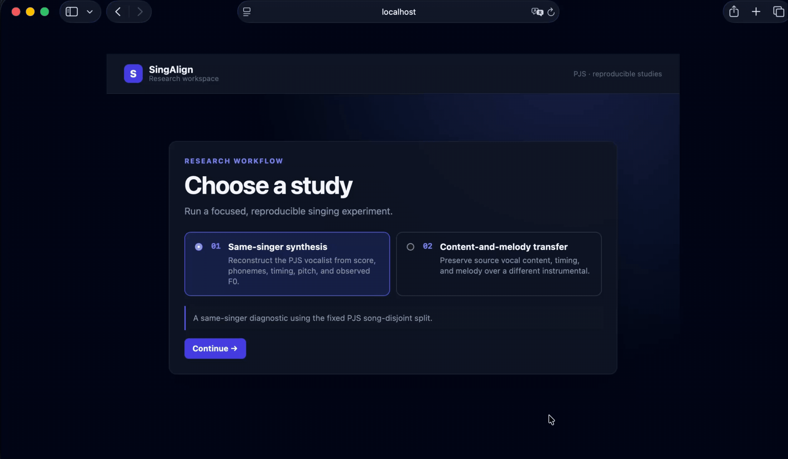

# SingAlign

SingAlign is a reproducible sandbox for training and evaluating singing-voice
systems on the PJS corpus. It focuses on objective signal analysis, traceable
experiments, and clear separation between working baselines and future research.

> [!IMPORTANT]
> The experimental sandbox is implemented, but the neural-model scaffolds and
> research conclusions are provisional. This is not a production singing
> synthesizer.

## Project at a glance

SingAlign supports two studies:

| Study | Goal | Current approach |
| --- | --- | --- |
| **1. Score-conditioned synthesis** | Reconstruct the PJS vocalist from phonemes, score timing, and pitch | Compact mel-model baseline |
| **2. Content-and-melody transfer** | Preserve a source vocal over a different instrumental | Deterministic pitch/tempo alignment and mixing |

Both studies follow the same evidence pipeline: prepare immutable PJS splits,
build conditioning records, run a study-specific baseline, evaluate it with
objective measurements, and preserve the reports, audio, and MLflow lineage.



The held-out test split is not available to training. Checkpoints are selected
on validation data and evaluated separately.

## Study 1: score-conditioned synthesis baseline

Study 1 uses aligned phoneme IDs and MusicXML/MIDI pitch and timing to predict
mel-spectrogram frames for the PJS vocalist. The conditioning interface keeps
crop offsets, duration, tempo, and acoustic frame rate explicit so a future
acoustic model can replace the compact baseline without changing data parsing.

Run the current conditioned mel model in Docker:

```bash
docker compose run --rm research \
  singalign-conditioned-train \
  --config configs/training/conditioned.yaml \
  --index data/interim/pjs/index.jsonl \
  --splits data/interim/pjs/splits.json
```

The run records training and validation loss, its resolved configuration, split
fingerprint, and checkpoint lineage in MLflow. It validates the Study 1
training contract, but does not yet produce a production-quality synthesized
vocal: that requires a stronger acoustic model, a complete generation path, and
a validated neural vocoder.

The exact conditioning, replacement, and evaluation contracts are documented
in [`docs/two-studies-experiments.md`](docs/two-studies-experiments.md#study-1-score-conditioned-synthesis).

## Study 2: deterministic transfer control

Study 2 uses a fixed MIDI/MusicXML-rendered instrumental so vocal alignment can
be measured without adding accompaniment generation as another variable.

The pipeline preserves the original vocal, aligned vocal, and final mix as
separate artifacts. It does not estimate key or beat automatically and is not a
trained voice-conversion model. The exact experiment controls and required
lineage are documented in
[`docs/two-studies-experiments.md`](docs/two-studies-experiments.md).

## What is implemented?

| Status | Scope |
| --- | --- |
| **Implemented** | PJS data pipeline, conditioning contracts, compact mel baseline, deterministic transfer, objective evaluation, Docker, MLflow, and UI |
| **Scaffolded** | Diffusion denoisers and schedules, vocoder contract, and preference-learning utilities |
| **Future research** | Trained diffusion weights, sampling, validated neural vocoder, human evaluation, and multi-singer studies |

The diffusion and preference-learning code makes later interfaces concrete; it
does not imply trained voice conversion, human preference alignment, or
unseen-singer generalization. PJS contains one vocalist. See
[`experiments/diffusion-voice-conversion-v1.md`](experiments/diffusion-voice-conversion-v1.md)
for the future model contract.

## What the sandbox is for

The sandbox is the reusable experimental spine, not a component that must be
discarded before building a real system. It already provides the controls
needed to replace a baseline with a stronger model and compare both versions
under the same conditions.

| Reusable layer | What it provides |
| --- | --- |
| Data | Provenance checks, immutable song-disjoint splits, and model-independent conditioning records |
| Run definitions | Versioned training/evaluation configs, seeds, manifests, and checkpoint selection rules |
| Execution | The same pinned Docker environment for training, evaluation, API, UI, and MLflow |
| Tracking | Code, data, configuration, metric, checkpoint, and artifact lineage |
| Evaluation | Shared objective metrics, deterministic controls, held-out evaluation, and report formats |
| Inspection | APIs and a UI for launching runs and comparing outputs without changing the experiment contract |

A new acoustic model, vocoder, or alignment method should enter through the
existing data and configuration contracts, produce the expected versioned
artifacts, and run beside the current baseline. This makes model development
repeatable and makes comparisons attributable to the changed component rather
than to a different split, preprocessing path, or evaluation procedure.

## Gap to an end-to-end vocal system

The current repository proves that the experimental workflow runs; it does not
yet prove that the generated vocal is useful. Reaching actual vocal synthesis
and learned transfer requires replacing or extending these stages:

| Workflow stage | Current component | Needed for an end-to-end system |
| --- | --- | --- |
| Training data | Small, single-vocalist PJS corpus | A suitably licensed multi-singer corpus with singer- and song-disjoint splits for generalization |
| Inference conditioning | Parsed phonemes, score events, timing, and frame contracts | Target phoneme durations and pitch/timing available without reference-performance leakage; singer/timbre conditioning when required |
| Study 1 acoustic model | Compact convolutional mel baseline | A trained sequence or diffusion acoustic model with a complete generation/sampling path |
| Waveform generation | Approximate Griffin-Lim output and an exploratory `MelVocoder` | A trained, validated neural vocoder compatible with the generated mel representation |
| Study 2 alignment | User-declared semitone and tempo transforms implemented with deterministic resampling | Score-, beat-, or audio-derived alignment plus higher-quality time/pitch transformation where inputs are not already aligned |
| Study 2 transfer | Aligned source vocal mixed with a fixed instrumental; no learned timbre conversion | A trained conversion or synthesis model conditioned on content, target F0/timing, and target singer/timbre |
| Quality evidence | Objective engineering diagnostics | Stable audio outputs, ablations, failure analysis, and a separate blinded listening protocol for perceptual claims |

### Study 1: complete synthesis path

Study 1 synthesizes from symbolic inputs. The reference vocal supplies training
targets and diagnostics, but it is not an inference input.

```text
Lyrics / phonemes ──> phoneme and duration encoder ──┐
                                                     │
MusicXML / MIDI ───> pitch and timing encoder ───────┤
                                                     │
Singer ID/reference -> singer embedding (optional) -─┘
                                                     │
                                                     v
                                           Sequence or diffusion
                                               acoustic model
                                                     │
                                                     v
                                              Mel spectrogram
                                                     │
                                                     v
                                               Neural vocoder
                                                     │
                                                     v
                                            Synthesized vocal WAV
```

The compact mel predictor currently occupies the acoustic-model stage. The
repository does not yet provide a trained production acoustic model, complete
diffusion sampler, or validated neural vocoder for this path.

### Study 2: complete learned-transfer path

Study 2 starts with an existing vocal and separates source content from the
target pitch, timing, and timbre requested by the experiment.

```text
Source vocal WAV ──> content / phoneme encoder ───-───┐
       │                                              │
       ├───────────> F0 / pitch extractor ────────--──┤
       │                                              │
       └───────────> timing / alignment ────-─────────┤
                                                      │
Target score / track -> target F0 and timing ─────────┤
                                                      │
Target singer/reference -> singer embedding ─────-────┘
                                                      │
                                                      v
                                           Learned transfer model
                                                      │
                                                      v
                                               Mel spectrogram
                                                      │
                                                      v
                                                Neural vocoder
                                                      │
                                                      v
                                             Converted vocal WAV
```

The deterministic pitch/tempo transform currently stands in for the learned
transfer and alignment stages. It produces a reproducible control, but it does
not perform learned content encoding, target-singer conversion, or neural vocal
generation.

The fixed MIDI instrumental and deterministic transfer remain useful controls
after learned models are added. They isolate whether an apparent improvement
comes from vocal generation, alignment, or accompaniment variation.

In practice, development should replace one stage at a time:

1. register the new component and configuration;
2. run it on the same training and validation partitions;
3. select its checkpoint using the same declared rule;
4. compare it with the deterministic or compact baseline; and
5. export a reviewable report before making a claim.

The [research plan](docs/research-plan.md) describes the evidence milestones and
the [two-study protocol](docs/two-studies-experiments.md) defines the shared run
contract.

## Quick start with Docker Compose

Docker is the recommended path and supports Apple Silicon. It provides a pinned
Python 3.11 environment and local MLflow tracking.

### 1. Get the data

Download PJS version 1.1 from the
[official corpus page](https://sites.google.com/site/shinnosuketakamichi/research-topics/pjs_corpus)
and place it at:

```text
data/raw/pjs/PJS_corpus_ver1.1/
```

The corpus is licensed under
[CC BY-SA 4.0](https://creativecommons.org/licenses/by-sa/4.0/). Dataset files
remain local and are ignored by Git. See [`data/README.md`](data/README.md) for
provenance, verification, and licensing details.

### 2. Build and start tracking

```bash
SINGALIGN_GIT_REVISION="$(git rev-parse HEAD)" \
SINGALIGN_GIT_DIRTY="$(test -n "$(git status --porcelain --untracked-files=no)" \
  && echo true || echo false)" \
docker compose build

docker compose up -d mlflow
docker compose ps
```

MLflow is available at [http://localhost:5001](http://localhost:5001). Local
tracking data persists in the ignored `.mlflow/` directory.

### 3. Validate, index, and split PJS

```bash
docker compose run --rm research \
  singalign-data validate \
  --root /workspace/data/raw/pjs/PJS_corpus_ver1.1

docker compose run --rm research \
  singalign-data index \
  --root /workspace/data/raw/pjs/PJS_corpus_ver1.1 \
  --output /workspace/data/interim/pjs/index.jsonl

docker compose run --rm research \
  singalign-data split \
  --index /workspace/data/interim/pjs/index.jsonl \
  --output /workspace/data/interim/pjs/splits.json \
  --seed 2026
```

The generated metadata remains local and ignored by Git.

### 4. Run the baseline workflow

Train the reconstruction baseline:

```bash
docker compose run --rm research \
  singalign-train \
  --config configs/training/baseline.yaml \
  --index data/interim/pjs/index.jsonl \
  --splits data/interim/pjs/splits.json
```

Select `checkpoints/baseline/best.pt` using validation loss, then evaluate it on
the immutable test split:

```bash
docker compose run --rm research \
  singalign-evaluate \
  --config configs/evaluation/baseline.yaml \
  --checkpoint checkpoints/baseline/best.pt \
  --index data/interim/pjs/index.jsonl \
  --splits data/interim/pjs/splits.json
```

Reports are written under `reports/evaluation/<run-id>/` and attached to the
MLflow run. They include aggregate and per-example metrics, confidence
intervals, latency, configuration, and data/checkpoint fingerprints.

This reconstruction run validates the shared data, checkpoint, and evaluation
infrastructure. The score-conditioned Study 1 baseline is described below.

### 5. Run tests and open the UI

```bash
docker compose build test
docker compose run --rm lint
docker compose run --rm test
docker compose up --build -d api ui
```

- Comparison UI: [http://localhost:4173](http://localhost:4173)
- API: [http://localhost:8000](http://localhost:8000)
- MLflow: [http://localhost:5001](http://localhost:5001)

The UI organizes work into **Training**, **Evaluation**, and **Comparison**.
Generated comparison audio uses approximate Griffin-Lim reconstruction and is
an inspection aid, not evidence of production audio quality or a blinded
listening study. See [`ui/README.md`](ui/README.md).

Stop services without deleting tracked runs:

```bash
docker compose down
```

Do not remove `.mlflow/` unless you intend to delete its local database and
artifacts.

## Evaluation

Objective signal-processing analysis is the primary evidence:

| Dimension | Examples |
| --- | --- |
| Pitch | F0 error, voiced/unvoiced error, note deviation |
| Timing | Onset and duration deviation |
| Content | ASR error and lyric recognition |
| Audio | Spectral/mel similarity, clipping, artifact analysis |
| Transfer | Content preservation and alignment against controls |

Metrics are imperfect proxies and are interpreted against explicit references
and controls. Human listening measures are complementary and must not be
implied by proxy preference experiments. See
[`docs/evaluation-protocol.md`](docs/evaluation-protocol.md).

## Repository map

```text
configs/          versioned training and evaluation settings
data/             dataset provenance and local-data conventions
docs/             research plans, protocols, and limitations
experiments/      registered experiment designs and manifests
reports/          generated evidence (mostly ignored)
src/singalign/    data, models, studies, evaluation, and tracking code
tests/            corpus-independent unit and integration tests
ui/               Dockerized experiment and comparison interface
```

Configuration says what a run means, source code executes it, MLflow records
its lineage, and reports hold its evidence. Raw data, checkpoints, generated
reports, and local MLflow state are not source artifacts.

## Research boundaries

SingAlign does not currently claim:

- production-quality singing synthesis or voice conversion
- human preference alignment
- unseen-singer or population-level generalization
- confirmatory listening-study results

Future work requires multi-singer song-disjoint data, trained diffusion models,
a sampling pipeline, a validated neural vocoder, automatic alignment, and an
appropriate human-evaluation design. Architecture references and detailed next
steps are in [`docs/research-plan.md`](docs/research-plan.md).

Singing-voice generation also raises consent, impersonation, copyright, and
synthetic-media risks. See
[`docs/responsible-research.md`](docs/responsible-research.md) for the project's
use and disclosure principles.

## Contributing

Contributions should state the hypothesis, controls, and reproducible evaluation
plan. See [`CONTRIBUTING.md`](CONTRIBUTING.md).

## Citation and license

Citation metadata is in [`CITATION.cff`](CITATION.cff). Repository code and
original documentation are licensed under the [Apache License 2.0](LICENSE).
Datasets, pretrained models, third-party implementations, and generated
artifacts may have separate terms.
